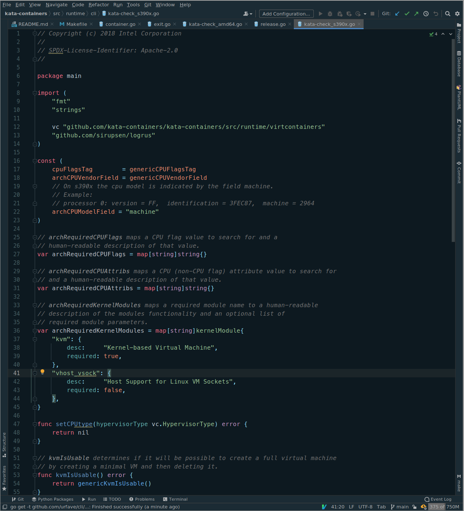

# Deep Focus Theme (JetBrains)

Deep Focus is a JetBrains theme specially designed for Go Language, and it's based on Next Ocean
color schema.

Main objective of the theme is to provide a calm environment for the developer where he can focus on.

Screenshot:

### Versioning

It uses semantic releases convention for releases.